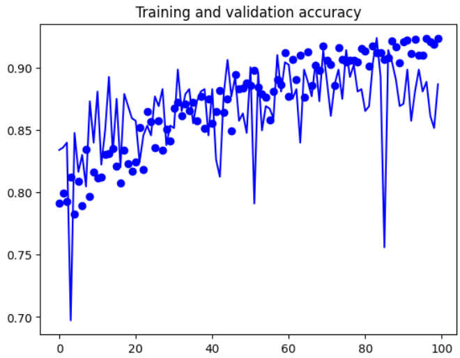
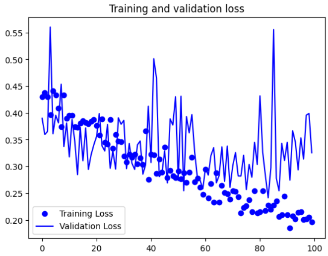

# Plant Disease Classification

<div align="center"> 
 
</div><br> 

<div align="justify"> 
This project presents a deep learning-based approach for accurately detecting plant diseases through image classification. Leveraging the power of Convolutional Neural Networks (CNNs), the system classifies leaf images into two categories: healthy and unhealthy. The goal is to enable early diagnosis of plant diseases, aiding farmers in taking timely action to reduce crop losses and enhance agricultural productivity. 
</div><br> 

<div align="justify"> The model is trained on high-resolution leaf images preprocessed to 150x150 dimensions to balance feature richness and computational efficiency. Using key CNN components such as Conv2D, MaxPooling, and ReLU activations, the architecture is optimized for binary classification with RMSprop as the optimizer and sigmoid output for final decision making. This work aims to demonstrate how computer vision can be effectively applied to real-world agricultural problems. </div><br> 

<div align="justify"> In addition to disease detection, the broader scope of this research also explores yield prediction using Random Forest and Linear Regression, showcasing a holistic approach to precision agriculture. By combining remote sensing data, climatic variables, and plant imaging, the system addresses multiple challenges in the modern agricultural landscape. </div>

## Setup
<h3>
<div>
 <b>Environment</b>
</div>
</h3>

*Note - The above codes are written using Python virtual environment version **3.12.1** and supports the latest Python versions. However, lower Python versions may offer more stability compared to the latest ones. Below setup will focus Windows system. And commands to setup may vary for macOS or Linux.*


<div> 1. Create a python virtual environment using -

```bash
# Path to installation of particular version of python  may vary
# I have installed more than one version of python in pyver directory
# Refer the resources section, for youtube video to install multiple versions of python
C:\Users\<username>\pyver\py3121\python -m venv threatenv
```
</div>


<div>2. Activate the virtual environment using -

```bash
threatenv/Scripts/activate
```
</div>

<div> 3. Install python packages using - 

```bash
pip install -r requirements.txt
```
<div>

<div> 4. Jupyter Notebook Configuration -

```bash
ipython kernel install --user --name=myenv
python -m ipykernel install --user --name=myenv
```
<div>

<div> 5. For bash based cell execution inside Jupyter (Optional) -

```bash
pip install bash_kernel
python -m bash_kernel.install
```
<div>

<div> 6. Congratulations! Now the environment is ready for execution -

```bash
jupyter notebook
```
<div>

## Motivation & Methodology

<div align="justify">
This project proposes a deep learning-based plant disease detection system that classifies plant leaf images as either healthy or unhealthy using Convolutional Neural Networks (CNNs). By combining computer vision with intelligent classification, the system enables early-stage disease identification, critical for minimizing crop loss and ensuring food security.
</div>
<br> 

**Motivation and Importance** <br>
In India and across the globe, plant diseases are a major factor in yield reduction and economic loss. Traditional disease monitoring is:
<ul>
<li>Manual and time-intensive</li>
<li>Subject to human error</li>
<li>Often reactive instead of preventive</li>
</ul>

This project addresses those limitations by automating disease detection through image-based classification. Such systems can empower:
<ul>
<li>Farmers, with quick diagnosis via smartphone-based imaging</li>
<li>Researchers, with scalable models for dataset labeling and analysis</li>
<li>Agri-tech platforms, integrating AI-driven diagnostics into larger crop monitoring solutions</li>
</ul> <br>

**CNN Architecture for Leaf Disease Detection** <br>
The model architecture was carefully designed for binary image classification, with an optimal input resolution and computational efficiency. 
<br>

| Layer Type | Functionality |
| :--: | :--: |
| Conv2D | Extracts spatial features from 150x150 RGB leaf images |
| ReLU Activation | Introduces non-linearity and removes negative values |
| MaxPooling2D | Reduces dimensionality while preserving the most relevant features |
| Flatten | Converts 2D feature maps into 1D vectors for dense layers |
| Dense (512 ReLU) | Captures high-level relationships across extracted features |
| Dense (1 Sigmoid) | Outputs the probability of disease presence (0 = healthy, 1 = unhealthy) |
<br>

**Training Configuration**
<ul>
<li>Input Format: Resized 150x150 plant leaf images</li>
<li>Loss Function: binary_crossentropy (ideal for binary classification)</li>
<li>Optimizer: RMSprop with adaptive learning adjustment</li>
<li>Metric Tracked: accuracy</li>
</ul>

## Results
<div align="justify">
The CNN model was trained for 100 epochs to classify leaf images into healthy and unhealthy categories. Below is a grouped performance summary highlighting the best metrics in 25-epoch intervals::
</div><br>

| Epoch Range | Best Val Accuracy | Min Val Loss | Corresponding Epoch | Notes                                                             |
|:--: |:-: |:--: |:--:|:--:|
| 1–25 | 0.8926 | 0.2845 | Epoch 14 | Sharp accuracy rise in early training; stable convergence begins |
| 26–50 | 0.9062 | 0.2693 | Epoch 47 | Model becomes robust; accuracy consistently above 87% |
| 51–75 | 0.9141 | 0.2567 | Epoch 76 | Strong generalization; low validation loss sustained |
| 76–100 | 0.9238 | 0.2414 | Epoch 84 | Highest validation accuracy achieved; model well-fitted |

<br>

<h3>Visualization</h3>
<div align="center"> 
<br><i>Visualization of accuracy for training and validation </i> 
</div><br>

<div align="center"> 
<br><i>Visualization of loss from training and validation</i> 
</div>

## References
<ol>
<li>Limbore, Nilesh. (2015). AN ANALYTICAL STUDY OF INDIAN AGRICULTURE CROP PRODUCTION AND EXPORT WITH REFERENCE TO WHEAT. Review of Research 2249-894X Impact points 3.1402(UIF). Volume 4. 11. </li>
<li>Haverkort, A. J., & Struik, P. C. (2015). Yield levels of potato crops: recent achievements and future prospects. Field Crops Research, 182, 76-85. </li>
<li>Harakannanavar, S. S., Rudagi, J. M., Puranikmath, V. I., Siddiqua, A., & Pramodhini, R. (2022). Plant leaf disease detection using computer vision and machine learning algorithms. Global Transitions Proceedings, 3(1), 305-310. </li>
<li>Krishnamoorthy, N., Prasad, L. N., Kumar, C. P., Subedi, B., Abraha, H. B., & Sathishkumar, V. E. (2021). Rice leaf diseases prediction using deep neural networks with transfer learning. Environmental Research, 198, 111275.</li>
<li>Chandrasekaran, V., Gupta, K., & Ramaiyah, M. (2021, November). Detection of Crops and their Diseases using Machine Learning. In 2021 Innovations in Power and Advanced Computing Technologies (i-PACT) (pp. 1-8). IEEE. </li>
<li>Leukel, J., Zimpel, T., & Stumpe, C. (2023). Machine learning technology for early prediction of grain yield at the field scale: A systematic review. Computers and Electronics in Agriculture, 207, 107721. </li>
<li>Van Klompenburg, T., Kassahun, A., & Catal, C. (2020). Crop yield prediction using machine learning: A systematic literature review. Computers and Electronics in Agriculture, 177, 105709. </li>
<li>Bali, N., & Singla, A. (2022). Emerging trends in machine learning to predict crop yield and study its influential factors: A survey. Archives of computational methods in engineering, 1-18.  </li>
<li>Van Klompenburg, T., Kassahun, A., & Catal, C. (2020). Crop yield prediction using machine learning: A systematic literature review. Computers and Electronics in Agriculture, 177, 105709. </li>
<li>Rashid, M., Bari, B. S., Yusup, Y., Kamaruddin, M. A., & Khan, N. (2021). A comprehensive review of crop yield prediction using machine learning approaches with special emphasis on palm oil yield prediction. IEEE access, 9, 63406-63439. </li>
<li>Anbananthen, K. S. M., Subbiah, S., Chelliah, D., Sivakumar, P., 
Somasundaram, V., Velshankar, K. H., & Khan, M. A. (2021). An intelligent decision support system for crop yield prediction using hybrid machine learning algorithms. F1000Research, 10. </li>
<li>Crane-Droesch, A. (2018). Machine learning methods for crop yield prediction and climate change impact assessment in agriculture. Environmental Research Letters, 13(11), 114003. </li>
<li>Xie, Y., & Huang, J. (2021). Integration of a crop growth model and deep learning methods to improve satellite-based yield estimation of winter wheat in Henan Province, China. Remote Sensing, 13(21), 4372. </li>
<li>Sharma, A., Jain, A., Gupta, P., & Chowdary, V. (2020). Machine learning applications for precision agriculture: A comprehensive review. IEEE Access, 9, 4843-4873. </li>
<li>Zhang, X., Han, L., Dong, Y., Shi, Y., Huang, W., Han, L., ... & Sobeih, T. (2019). A deep learning-based approach for automated yellow rust disease detection from high-resolution hyperspectral UAV images. Remote Sensing, 11(13), 1554. </li>
<li>Saleem, M. H., Potgieter, J., & Arif, K. M. (2019). Plant disease detection and classification by deep learning. Plants, 8(11), 468. </li>
<li>Zhang, X., Han, L., Dong, Y., Shi, Y., Huang, W., Han, L., ... & Sobeih, T. (2019). A deep learning-based approach for automated yellow rust disease detection from high-resolution hyperspectral UAV images. Remote Sensing, 11(13), 1554. </li>
<li>Nguyen, C., Sagan, V., Maimaitiyiming, M., Maimaitijiang, M., Bhadra, S., & Kwasniewski, M. T. (2021). Early detection of plant viral disease using hyperspectral imaging and deep learning. Sensors, 21(3), 742. </li>
<li>Batchuluun, G., Nam, S. H., & Park, K. R. (2022). Deep Learning-based plant classification and crop disease classification by thermal camera. Journal of King Saud University-Computer and Information Sciences, 34(10), 1047410486. </li>
<li>Abbas, F., Afzaal, H., Farooque, A. A., & Tang, S. (2020). Crop yield prediction through proximal sensing and machine learning algorithms. Agronomy, 10(7), 1046. </li>
<li>Nevavuori, P., Narra, N., Linna, P., & Lipping, T. (2020). Crop yield prediction using multitemporal UAV data and spatio-temporal deep learning models. Remote sensing, 12(23), 4000. </li>
<li>Van Klompenburg, T., Kassahun, A., & Catal, C. (2020). Crop yield prediction using machine learning: A systematic literature review. Computers and Electronics in Agriculture, 177, 105709. </li>
<li>Lu, J., Dai, E., Miao, Y., & Kusnierek, K. (2022). Improving active canopy sensor-based in-season rice nitrogen status diagnosis and recommendation using multi-source data fusion with machine learning. Journal of Cleaner Production, 380, 134926. </li>
<li>Van Klompenburg, T., Kassahun, A., & Catal, C. (2020). Crop yield 
prediction using machine learning: A systematic literature review. Computers and Electronics in Agriculture, 177, 105709. </li>
<li>Jácome-Galarza, L. R. (2022, October). Multimodal Deep Learning for Crop Yield Prediction. In Doctoral Symposium on Information and Communication Technologies (pp. 106-117). Cham: Springer International Publishing. </li>
<li>Suresh, Namgiri, et al. "Crop yield prediction using random forest algorithm." 2021 7th international conference on advanced computing and communication systems (ICACCS). Vol. 1. IEEE, 2021. </li>
<li>Jeong, Jig Han, et al. "Random forests for global and regional crop yield predictions." PloS one 11.6 (2016): e0156571. </li>
<li>James, G., Witten, D., Hastie, T., Tibshirani, R., & Taylor, J. (2023). Linear regression. In An Introduction to Statistical Learning: With Applications in Python (pp. 69-134). Cham: Springer International Publishing. </li>
<li>Ramesh, D., & Vardhan, B. V. (2015). Analysis of crop yield prediction using data mining techniques. International Journal of research in engineering and technology, 4(1), 47-473. </li>
<li>Lin, G., & Shen, W. (2018). Research on convolutional neural network based on improved Relu piecewise activation function. Procedia computer science, 131, 977-984. </li>
<li>Lu J, Tan L, Jiang H. Review on Convolutional Neural Network (CNN) Applied to Plant Leaf Disease Classification. https://doi.org/10.3390/agriculture11080707A</li>
</ol>
