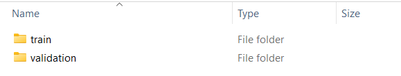
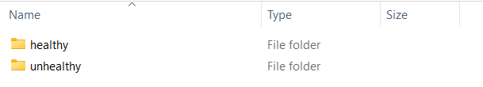
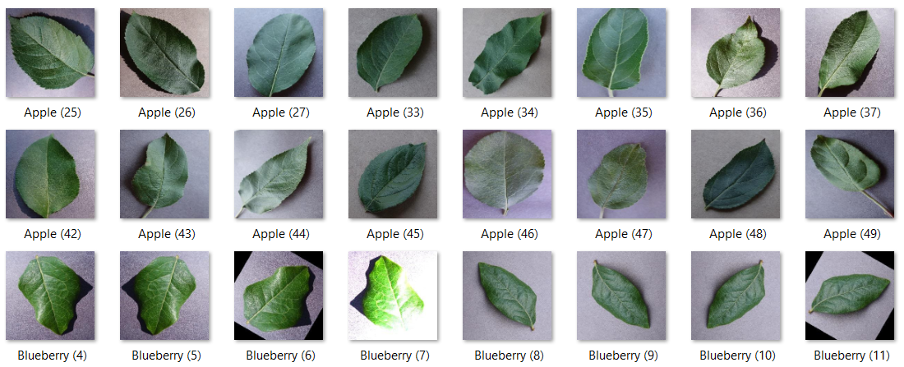
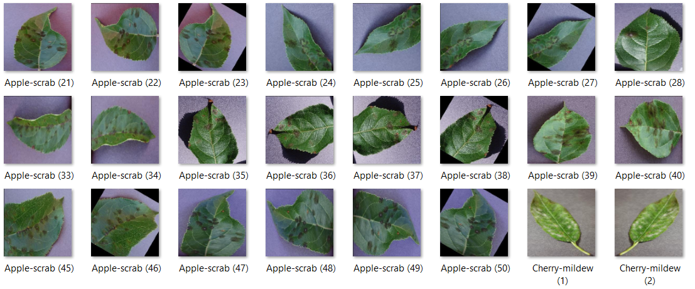

# Week 1
## Dataset
The dataset to analyze disease in a plant via shape and texture of leaves, is divided into train and validation set.

	

## Categories
Then we categorize plant leaves as healthy and unhealthy, which means it is a binary classification problem.

	

## Samples
Now let's see a sample of healthy and unhealthy plant leaves, which are used to train the model.

	Healthy
	

  

	Unhealthy
	

